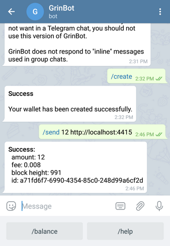
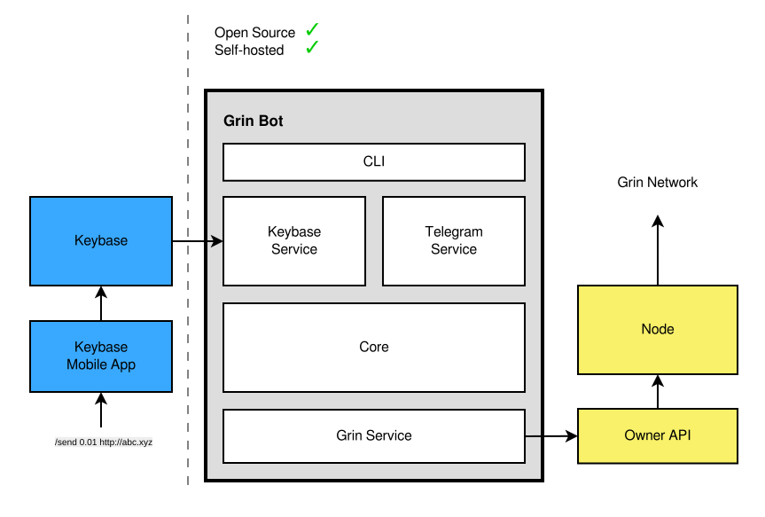

# Grin Bot

Grin Bot is a self-hosted Keybase or Telegram bot wallet for the [Grin](https://grin.mw/) cryptocurrency. You can run Grin Bot on your own desktop hardware, and control it from a smartphone.



# Getting started

## Building

### Docker

```shell
git clone --branch v0.0.1 https://github.com/alexbyrnes/grinbot.git
cd grinbot
docker build -t grinbot .
docker run -it grinbot
```

### From source

```shell
git clone --branch v0.0.1 https://github.com/alexbyrnes/grinbot.git
cargo install --path grinbot --locked
```

### From source &mdash; no install
```shell
git clone --branch v0.0.1 https://github.com/alexbyrnes/grinbot.git
cd grinbot
cargo run
```

### Testing

```shell
cargo test --all
```

### Rust docs
```shell
cargo doc --no-deps --document-private-items --open --all
```
## Running and interacting without an account

All commands can be executed locally without a Keybase or Telegram account.

```shell
grinbot -c "/help"
```
## Starting the Grin Wallet Owner API

In a [grin-wallet](https://github.com/mimblewimble/grin-wallet) directory:
```shell
grin-wallet owner_api
```

## Running and interacting with your account

### Requirements
* The Grin Wallet Owner API. [Repository](https://github.com/mimblewimble/grin-wallet)

_Keybase_
* A Keybase desktop client, and a mobile client for issuing commands. [Download](https://keybase.io/download)
* A Keybase account with a paper key generated. Devices --> "Add device or paper key" or [command line](https://keybase.io/docs/command_line).

_Telegram_
* A Telegram account with username. [Download](https://telegram.org/)
* A bot instance. [Instructions](https://core.telegram.org/bots#6-botfather)
Once your bot instance is [created](https://core.telegram.org/bots#6-botfather) you should receive a message with your token. Enter the token and your username in [config.yml](config.yml).

### Running the bot

Start the bot by running `grinbot` in a directory with config.yml and logging.yml, or `cargo run` in the root of the repository.

_Keybase_
Open a Keybase client and start a chat with yourself, or the username associated with your paper key. (The key and user name(s) go in config.yml.)

_Telegram_
Go to the link provided by Telegram on the device or desktop where Telegram is installed. (The link starts with `https://t.me/`.) You should get a prompt to open a chat with your bot.

Type and send `/help` for a list of commands.

Note: The best source of troubleshooting information is the [dockerfile](dockerfile) where a complete bot with Grin node and wallet is set up from scratch.

```shell
docker build -t grinbot .
docker run -it grinbot
```
## Commands
    /create
  _Create a Grin wallet in the directory specified in your config.yml._
    /send 0.001 http://some-recipient123.org
  _Send Grin to the specified address._
    /balance
  _Get the current balance for your wallet.
    /help
  _Show this help text._

## Architecture and Security
_Keybase_
Keybase chats are end-to-end encrypted and the bot acts as a regular user. The privacy guarantees provided by Keybase are the same as those for chats with any other user. These guarantees don't include protection from loss of your paper key, or issues with Grin Bot itself, or external libraries. Paper keys can be revoked through the Keybase clients.

_Telegram_
Grin Bot uses the Telegram bot long polling interface. This means there's no need for an externally-accessible IP or port. Grin Bot will connect to Telegram and pull new messages (called [Updates](https://core.telegram.org/bots/api#getting-updates)) from an endpoint specifically for your bot instance using your token. To get an idea of how this works, you can visit `https://api.telegram.org/bot<your api token>/getUpdates` to manually consume messages you have sent your bot. This is the address Grin Bot polls.

The only information that is sent to Telegram is the contents of the chat itself &mdash; the commands you send to your bot and the messages it sends back. The commands and replies do not include passwords or tokens.

*_Note:_* Telegram bot traffic is _not_ end-to-end encrypted, however Telegram claims [GDPR compliance](https://telegram.org/faq#q-what-about-gdpr) and the ability to [delete messages](https://telegram.org/faq#q-can-i-delete-my-messages). If you are using Grin Bot for purposes that require stronger security guarantees than these, you should not use this version of Grin Bot.



## Roadmap
* Command aliases
* Confirmation dialogs
* `grinbot init` for default config files

## Contributing

Contributions are welcome. Please submit an issue, or claim an existing one for visibility, and PR against the develop branch.

